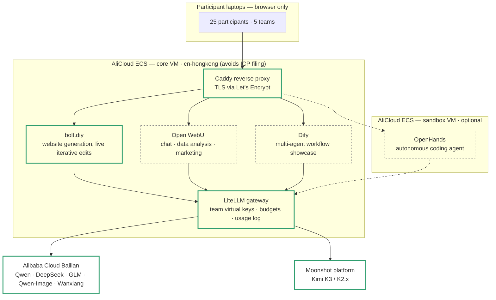
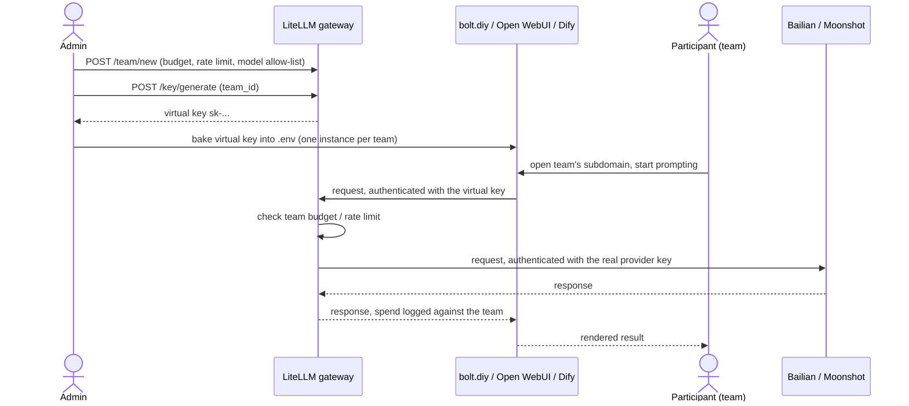

# Architecture — Shanghai AI Hackathon Platform

The target system this repo is building toward, what's actually implemented
today, and why it's shaped the way it is. For hands-on deploy steps, see
[README.md](README.md) — this file is the plan, that one is the how-to.

## Goals & constraints

- 25 participants, 5 teams, one half-day event, Shanghai.
- **Zero local installs** — participants reach everything through a browser
  URL on a locked-down corporate laptop.
- **Chinese models only**: DeepSeek, Qwen (Tongyi), GLM (Zhipu), Kimi
  (Moonshot).
- The website track needs **iterative editing, not full regeneration** —
  "make the nav sticky" should patch the running app, not rebuild it.
- At least one track should make the case for **agentic multi-agent
  workflows** over a single LLM call, visibly and live, not as a slide.
- Cloud-first on AliCloud, with a Mac Mini running the identical Compose
  stack as an offline fallback if the VM or venue network fails.

## Target architecture

Solid outline = implemented in this repo today. Dashed = designed, not yet
built. See [Status](#status) below for the checklist version.

**Why a gateway in front of the model providers, instead of each app
calling Bailian/Moonshot directly:** four apps × two-to-three providers is a
lot of places to leak or mismanage a real API key. LiteLLM holds the real
upstream keys once and issues a **virtual key per team**, each with its own
token budget, rate limit, and model allow-list. Every app just points at
`http://litellm:4000/v1` as if it were one OpenAI-compatible provider with a
model picker — and you get one dashboard to watch spend live during the
event instead of four provider consoles.

## Who's issuing what to whom

The real Bailian/Moonshot secrets exist in exactly one place — the
`litellm` container's environment. A leaked virtual key exposes only its
own team's budget, never the sponsor's real account.

## Components

| Track | Tool | Why this one | Status |
|---|---|---|---|
| Website generation, live iterative editing | **bolt.diy** | In-browser sandboxed Node runtime (WebContainers); diff-based edits patch the running app instead of regenerating it | ✅ Implemented |
| Model gateway | **LiteLLM** | Holds real provider keys, issues per-team virtual keys with budgets/rate limits, one spend dashboard | ✅ Implemented |
| Chat / data analysis / marketing text & images | **Open WebUI** | Chat UI, file upload, built-in Python/Jupyter code interpreter, pluggable image-gen backend | ✅ Implemented |
| Agentic multi-agent showcase | **Dify** | Visual multi-agent workflow builder; one team = one workspace, which is also its credential boundary | 🔲 Planned |
| Advanced/optional track | **OpenHands** | Autonomous coding agent with sub-agent delegation; isolated on its own VM since its Docker-in-Docker sandboxing is the riskiest piece | 🔲 Planned, optional |

## Model sourcing

| Provider | Models | Notes |
|---|---|---|
| **Alibaba Cloud Bailian (Model Studio)** | Qwen 3.7/3.8, DeepSeek V4, GLM text models, Qwen-Image, Tongyi Wanxiang (video) | One account/key covers 3 of 4 model families plus image and video gen — the backbone |
| **Moonshot (Kimi)** | Kimi K3, K2.6/K2.7-Code | Separate account, not on Bailian |

Both are wired into `app/litellm-config.yaml` today. See
[README.md](README.md) for where to get each key.

## Status

- [x] AliCloud network + VM, provisioned with OpenTofu (`infra/`)
- [x] LiteLLM gateway, Postgres-backed for persistent teams/keys/spend (`app/`)
- [x] One bolt.diy instance, wired to the gateway via its OpenAI-Like provider slot (`app/`)
- [x] Verified locally end-to-end before first cloud deploy (see README's
      "Known quirks" — the published bolt.diy image needed a runtime fix)
- [x] One Open WebUI instance (`app/`), wired to the gateway with its own
      virtual key; Jupyter-backed code interpreter with `data/` (all 4
      hackathon tracks) mounted read-only, so any team can `pd.read_csv()`
      their track without uploading anything — team-to-track assignment
      isn't known ahead of time, so every team's instance gets all of them
- [ ] Dify with 5 per-team workspaces
- [ ] Replicate bolt.diy (and Open WebUI) to one instance per team, each
      with its own baked-in virtual key and subdomain
- [ ] Optional: second VM + OpenHands for the advanced track

## Design decisions

- **OpenTofu, not Terraform**, for the AliCloud resources — drop-in
  compatible fork, same HCL and provider; the AliCloud provider is pinned
  to the full `registry.terraform.io/aliyun/alicloud` source explicitly
  rather than relying on OpenTofu's own registry to have it mirrored.
- **OpenTofu owns cloud resources, Docker Compose owns the app layer** —
  keeps the environment destroyable/re-creatable as code (`tofu destroy`
  after the event) without dragging in Kubernetes for two containers on
  one box, and keeps the app stack testable locally and portable to the
  Mac Mini backup unmodified.
- **One LiteLLM + one bolt.diy instance first**, not all five tracks at
  once — proves the full request path (DNS → Caddy → app → LiteLLM →
  Bailian/Moonshot) end to end before replicating it five ways.
- **Per-team app instances over shared-instance BYO-key** for the scale-out
  step — a team pasting the wrong key into a shared login is a support
  ticket at the worst possible moment (kickoff); baking each team's key
  into its own container removes that failure mode entirely.
