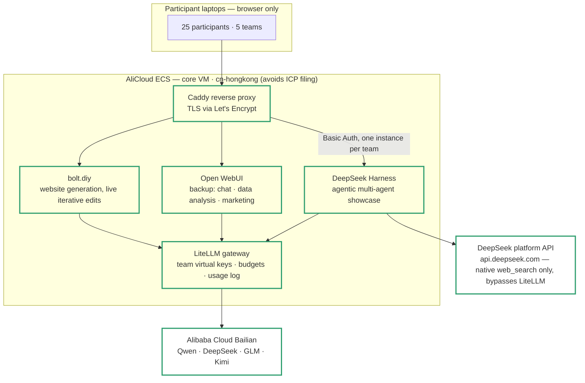
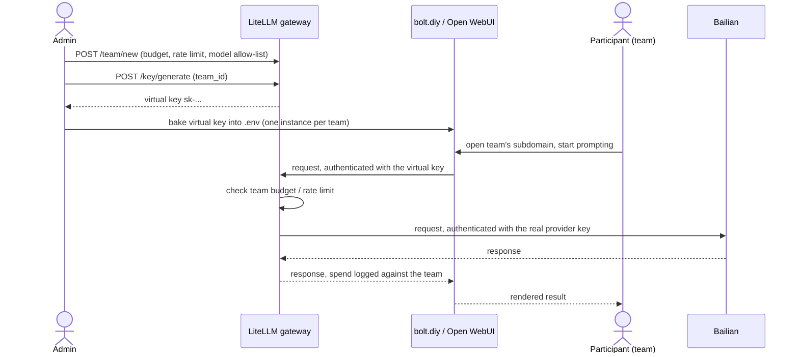

# Architecture — Shanghai AI Hackathon Platform

The target system this repo is building toward, what's actually implemented
today, and why it's shaped the way it is. For hands-on deploy steps, see
[README.md](README.md) — this file is the plan, that one is the how-to.

## Goals & constraints

- 25 participants, 5 teams, one half-day event, Shanghai.
- **Zero local installs** — participants reach everything through a browser
  URL on a locked-down corporate laptop.
- **Chinese models only**: DeepSeek, Qwen (Tongyi), GLM (Zhipu), Kimi —
  all sourced through one Alibaba Cloud Bailian account; no separate
  Moonshot platform account is used or needed (Bailian hosts Kimi itself).
- The website track needs **iterative editing, not full regeneration** —
  "make the nav sticky" should patch the running app, not rebuild it.
- At least one track should make the case for **agentic multi-agent
  workflows** over a single LLM call, visibly and live, not as a slide.
- Cloud-first on AliCloud, with a Mac Mini running the identical Compose
  stack as an offline fallback if the VM or venue network fails.

## Target architecture

**Update (2026-09-01): the `RP -.-> DS` edge is now solid.** `dsh` is
replicated one instance per team (team0-5, team0 being the organizer's own
always-on instance, same pattern as `boltdiy`), each behind its own
subdomain and gated by Caddy `basic_auth` — `dsh` itself still has no login
wall of its own, so that gate lives in front of it, same reasoning as
before, now built rather than planned. See [Status](#status) below for the
checklist, and
[Evaluated, not used](#evaluated-not-used) for Dify/DeerFlow/OpenHands —
all three were built out or seriously evaluated, then deliberately dropped
from the active plan (2026-09-01): DeepSeek Harness's per-track team
presets cover the "agentic multi-agent, visibly and live" goal below, and
Open WebUI stays only as a backup.

**Why a gateway in front of the model provider, instead of each app calling
Bailian directly:** four apps sharing one real API key is a lot of places
to leak or mismanage it. LiteLLM holds the real upstream key once and
issues a **virtual key per team**, each with its own token budget, rate
limit, and model allow-list. Every app just points at
`http://litellm:4000/v1` as if it were one OpenAI-compatible provider with a
model picker — and you get one dashboard to watch spend live during the
event instead of juggling the Bailian console directly.

## Who's issuing what to whom

The real Bailian secret exists in exactly one place — the `litellm`
container's environment. A leaked virtual key exposes only its own team's
budget, never the sponsor's real account.

## Components

| Track | Tool | Why this one | Status |
|---|---|---|---|
| Website generation, live iterative editing | **bolt.diy** | In-browser sandboxed Node runtime (WebContainers); diff-based edits patch the running app instead of regenerating it | ✅ Implemented |
| Model gateway | **LiteLLM** | Holds real provider keys, issues per-team virtual keys with budgets/rate limits, one spend dashboard | ✅ Implemented |
| Chat / data analysis / marketing text & images — **backup** | **Open WebUI** | Chat UI, file upload, built-in Python/Jupyter code interpreter, pluggable image-gen backend; kept as a fallback, not a primary track tool | ✅ Implemented, backup |
| Agentic multi-agent showcase | **DeepSeek Harness** | Plugin-first agent harness with a plan/goal/subagent UI and four hand-authored per-track team presets; `dsh` itself is deliberately loopback-only (upstream safety choice — real bash/filesystem access, no login wall), so each team's instance sits behind its own Caddy subdomain + Basic Auth | ✅ Implemented, one always-on instance per team (team0-5, team0 = organizer) |

## Evaluated, not used

Reviewed and deliberately dropped from the active plan (2026-09-01), kept
here rather than silently deleted — each was either built out or seriously
evaluated, and the reasoning is worth keeping alongside the decision:

| Tool | What it was for | Status | Where the work lives |
|---|---|---|---|
| **Dify** | Original agentic multi-agent showcase — visual workflow builder, one team = one workspace | Built and confirmed working (admin bootstrap, LiteLLM model provider, a template research-agent workflow), then dropped: DeepSeek Harness's team presets cover the same "agentic, visibly and live" goal directly in a chat interface, without a second app to deploy and operate per team | [docs/dify-research-agent/](docs/dify-research-agent/) |
| **DeerFlow** | Research → plan → build super-agent, an alternative/complementary agentic showcase | Fully vendored and verified working end-to-end (see its own doc), but never merged into `main` — superseded by the same DeepSeek Harness decision above before it was ever deployed alongside the others | `deerflow` branch (not on `main`); [docs/deerflow/](docs/deerflow/) |
| **OpenHands** | Advanced/optional track — autonomous coding agent, isolated on its own VM | Evaluated at the planning stage, never built — the second-VM isolation cost (Docker-in-Docker sandboxing) wasn't justified once DeepSeek Harness covered the agentic-showcase goal from a single VM | Nothing to link; this file's own git history is the record |

## Model sourcing

| Provider | Models | Notes |
|---|---|---|
| **Alibaba Cloud Bailian (Model Studio)** | `qwen3.8-flash`, `deepseek-v4-flash-0731`, `deepseek-v4-pro-0813`, `kimi-k2.7-code`, `glm-5.2` | **The only LLM provider.** One account/key (`DASHSCOPE_API_KEY`) covers every model in use, Kimi included — no separate Moonshot platform account exists or is needed. `kimi-k2.7-code` stays in the roster for bolt.diy (it's the strongest of the five for coding); DeepSeek Harness's own model list drops it — the other four cover its use case and there's no reason to offer it there too. |
| **DeepSeek platform (`api.deepseek.com`)** | N/A — no chat model routed through it | **Not a LiteLLM provider at all.** A second, genuinely separate credential (`DEEPSEEK_API_KEY`), used only by DeepSeek Harness's web-search tool, which calls DeepSeek's own native `web_search` server tool directly — bypasses LiteLLM/Bailian entirely, confirmed working end to end. See [docs/deepseek-harness/](docs/deepseek-harness/). |

Bailian is wired into `app/litellm-config.yaml`; the DeepSeek platform key
is wired into `app/deepseek-harness`'s own env, separately. See
[README.md](README.md) for where to get each key.

## Status

- [x] AliCloud network + VM, provisioned with OpenTofu (`infra/`)
- [x] LiteLLM gateway, Postgres-backed for persistent teams/keys/spend (`app/`)
- [x] One bolt.diy instance, wired to the gateway via its OpenAI-Like provider slot (`app/`)
- [x] Verified locally end-to-end before first cloud deploy (see README's
      "Known quirks" — the published bolt.diy image needed a runtime fix)
- [x] One Open WebUI instance (`app/`), wired to the gateway with its own
      virtual key; Jupyter-backed code interpreter with `data/` (all 4
      hackathon tracks) mounted read-only, so any team can `pd.read_csv()`
      their track without uploading anything — team-to-track assignment
      isn't known ahead of time, so every team's instance gets all of them.
      **Kept only as a backup** (2026-09-01) — see
      [Evaluated, not used](#evaluated-not-used) for why it's no longer a
      primary track tool
- [x] One DeepSeek Harness (`dsh`) instance (`app/deepseek-harness/`,
      npm-installed, not vendored — no from-source build needed, see
      [docs/deepseek-harness/](docs/deepseek-harness/)), same LiteLLM
      instance as the rest of the stack via its own virtual key —
      **local-only, on purpose**: `dsh`'s own CLI refuses to bind anything
      but `127.0.0.1`, so a `deepseek-harness-proxy` sidecar shares its
      network namespace (`network_mode: "service:deepseek-harness"`) to
      make it reachable at all, and only `docker-compose.override.yml`
      publishes it (loopback-only host port, excluded from the cloud
      deploy) — no Caddy route, no public subdomain
- [x] Replicated bolt.diy to one instance per team (`boltdiy-team0`..`5`,
      team0 = the organizer's own instance), each with its own baked-in
      virtual key and subdomain (`app/docker-compose.yml`, `app/Caddyfile`)
- [x] Put DeepSeek Harness behind Caddy, one instance per team
      (`deepseek-harness-team0`..`5`) — own subdomain, own LiteLLM virtual
      key, own home/workspace bind mount — gated by Caddy `basic_auth`
      (username `team0`..`team5`), since `dsh` itself has no login wall of
      its own
- [x] `team0`: originally an on-demand-only organizer instance (gated
      behind a Compose `organizer` profile), changed 2026-09-02 to
      always-on, same as team1-5 — no longer a special case
- [x] Open WebUI's own unauthenticated default (`WEBUI_AUTH=False`) gated
      from outside with Caddy `basic_auth` too (one shared passphrase,
      username `guest`) — it's a public URL sitting in front of a paid
      model budget, and this project doesn't have accounts for every
      hackathon participant to log in with
- [x] Bumped `instance_type` to `ecs.g9i.2xlarge` (8 vCPU/32GB) and added an
      8GB swap file (`infra/cloud-init.sh`) to size for all replicas
      running at once, prioritizing reliability over cost efficiency
- [x] `scripts/generate-team-auth.sh` (mints + hashes a memorable
      passphrase per team) and `scripts/mint-team-keys.sh` (mints every
      team's pair of LiteLLM virtual keys) — automate what would otherwise
      be 12+ manual curl calls per redeploy
- [x] **Live on the VM** (2026-09-02): all 5 teams' `buildN`/`teamN`
      subdomains confirmed responding `200` with real Basic Auth
      credentials end to end; `gateway` confirmed alive; 12 virtual keys
      minted. `instance_type` bump itself (the `ecs.g9i.2xlarge` resize)
      still not applied — deployed onto the still-running `g9i.xlarge` via
      SSH-free tooling (see [docs/ssh-connectivity/](docs/ssh-connectivity/)
      for why: SSH from the operator's machine is blocked by a local
      corporate endpoint-security policy, unrelated to this project).
      Apply the resize with `cd infra && tofu apply` at a moment that can
      tolerate a brief stop/start — see README's "Scaling to 5 teams"

## Design decisions

- **OpenTofu, not Terraform**, for the AliCloud resources — drop-in
  compatible fork, same HCL and provider; the AliCloud provider is pinned
  to the full `registry.terraform.io/aliyun/alicloud` source explicitly
  rather than relying on OpenTofu's own registry to have it mirrored.
- **OpenTofu owns cloud resources, Docker Compose owns the app layer** —
  keeps the environment destroyable/re-creatable as code (`tofu destroy`
  after the event) without dragging in Kubernetes for two containers on
  one box, and keeps the app stack testable locally and portable to the
  Mac Mini backup unmodified.
- **One LiteLLM + one bolt.diy instance first**, not all five tracks at
  once — proves the full request path (DNS → Caddy → app → LiteLLM →
  Bailian) end to end before replicating it five ways.
- **Per-team app instances over shared-instance BYO-key** for the scale-out
  step — a team pasting the wrong key into a shared login is a support
  ticket at the worst possible moment (kickoff); baking each team's key
  into its own container removes that failure mode entirely.
